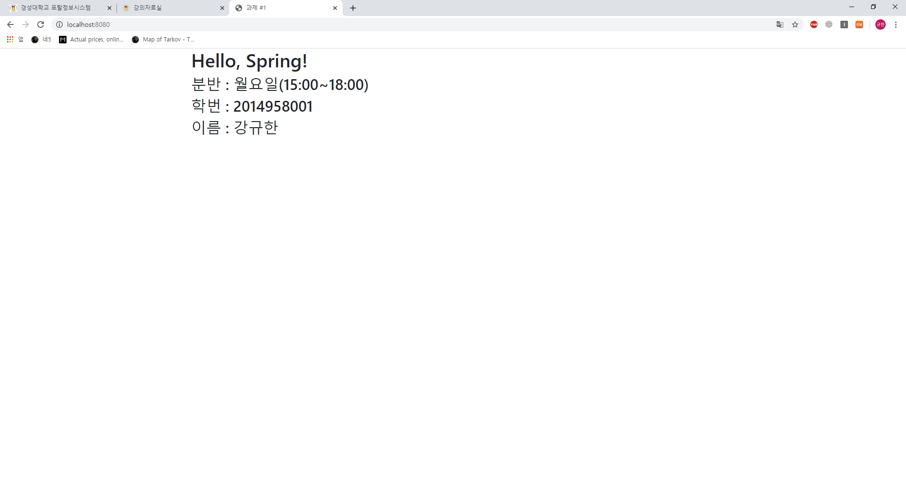
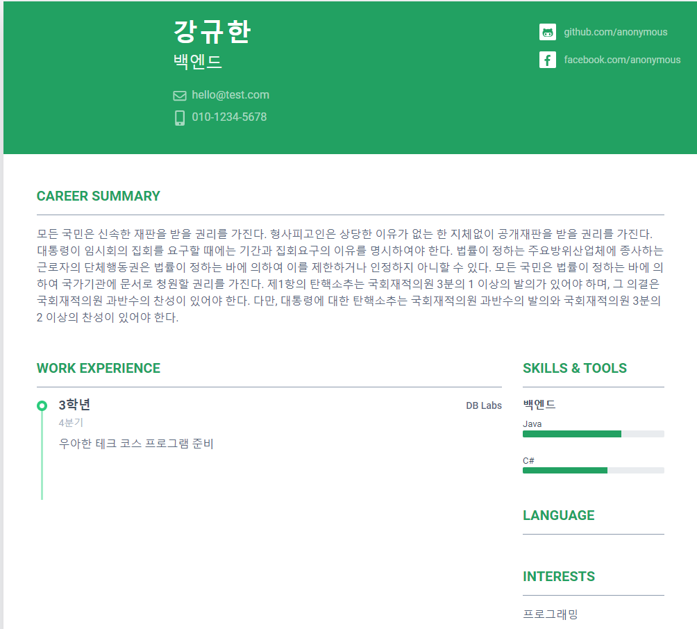

# ks-web

웹 프로그래밍 과제를 위한 저장소

## 준비물
- JDK(>=8)
- gradle or IntelliJ

## 과제 1 요구사항
- 웹 화면에 예시 문구를 출력한다.

## 출력 결과

## 과제 2 요구사항
- View와 Model을 다루는 연습
- Entity를 생성하는 간단한 방법을 연습
- View와 Model을 연결하는 방법을 연습
- HTML의 form을 사용해서 CRUD하는 방법을 연습

## 출력 결과

